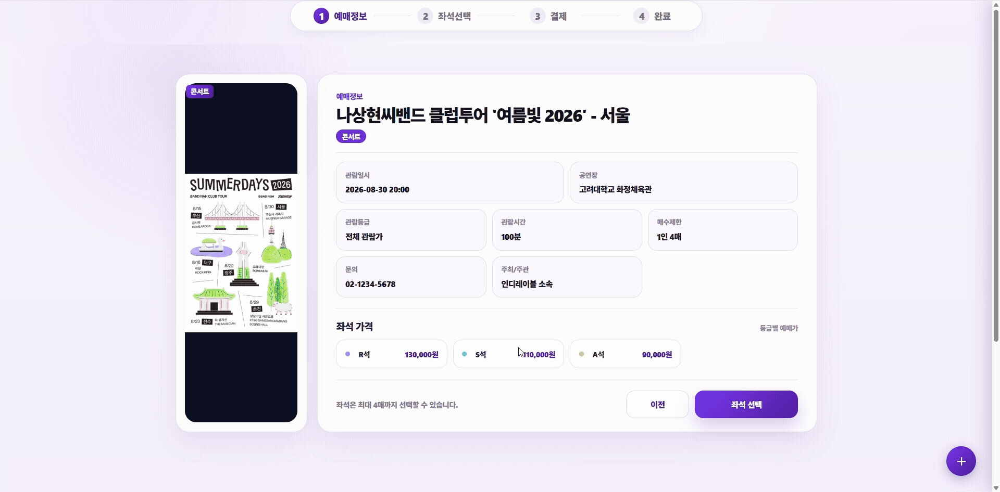

# CatchCatch

콘서트 예매 시 발생하는 대규모 동시 접속을 안정적으로 처리하는 실시간 대기열 기반 콘서트 티켓팅 플랫폼입니다.

대기열 진입 → 좌석 선택 → 결제까지 이어지는 예매 전 과정을 다루며, 트래픽이 몰리는 오픈 시점에도 공정한 순서로 사용자를 입장시키는 것을 핵심 목표로 합니다.

---

## 시연 화면

### 좌석 선택



<details>
<summary><strong>사용자 예매 플로우</strong></summary>

| 회원가입 | 일반 로그인 |
|---|---|
|  |  |

| 공연 날짜 선택 | 공연 예매 |
|---|---|
|  |  |

| 예매 내역 | 예매 취소 |
|---|---|
|  |  |

</details>

<details>
<summary><strong>관리자 기능</strong></summary>

| 관리자 로그인 | 관리자 대시보드 |
|---|---|
|  |  |

| 최근 예매 | 예매 내역 조회 |
|---|---|
|  |  |

| 예매 취소 | 공연별 예매율 |
|---|---|
|  |  |

| 공연 목록 조회 | 공연 상세 |
|---|---|
|  |  |

| 공연 등록 | 공연 수정 |
|---|---|
|  |  |

| 공연 삭제 | 공연 회차 관리 |
|---|---|
|  |  |

</details>

<details>
<summary><strong>결제 / 포인트 / AI</strong></summary>

| 결제 내역 | 포인트 내역 |
|---|---|
|  |  |

| 포인트 지급 | AI 비서 |
|---|---|
|  |  |

</details>

---

## 주요 기능

### 실시간 대기열 (Queue)

대기열은 Redis를 기반으로 동작하며, 사용자 상태는 `WAITING → READY → ENTERED` 순으로 전환됩니다.

- **WAITING**: 대기열 진입 시 순번(`queueNumber`)을 발급받고 ZSET에 등록됩니다. 앞 대기자 수(`waitingAhead`)가 실시간으로 감소하며, 좌석이 모두 매진되면 `SOLD_OUT` 상태로 즉시 안내됩니다.
- **READY**: 용량(capacity) 내에서 앞쪽 대기자를 READY로 승격합니다. 입장 토큰을 발급하며 TTL 10분이 지나면 자동 만료됩니다. 만료 시 Redis keyspace 이벤트로 즉시 감지하여 다음 대기자를 승격시킵니다.
- **ENTERED**: `enter-booking` API 호출로 좌석 선택 화면에 진입한 상태입니다. TTL 15분이 지나도록 결제를 완료하지 않으면 자동 해제되며, 빈 자리만큼 다음 대기자가 즉시 승격됩니다.
- **capacity**: `min(인프라 동시 처리 상한, 남은 AVAILABLE 좌석 수)`로 계산됩니다. 인프라 상한(`catchcatch.queue.concurrency-limit`)은 `application.yaml`에서 관리합니다.
- 승격/만료 처리는 이벤트 기반(keyspace notification, 결제 완료/취소 시점 직접 호출)이 주(主)이며, `QueueScheduler`는 이벤트 유실 대비 5분 주기 안전망 역할만 합니다.
- SSE(`/api/queue/subscribe/{concertSessionId}`)로 대기 상태 변경을 실시간으로 클라이언트에 푸시합니다.
- k6 부하 테스트로 2000명 동시 진입부터 좌석 선택, 결제까지 전체 플로우를 검증합니다(`loadtest/queue-test.js`).

### 예매 / 좌석 (Booking / Seat)

- 공연 - 회차 - 좌석 구조로 데이터를 모델링하며, 좌석은 등급(VIP/R/S/A 등)별로 가격이 설정됩니다.
- 좌석 상태는 `AVAILABLE → HELD(선점) → SOLD(판매 완료)` 순으로 관리됩니다.
- 예매 상태는 `PENDING(결제 대기) → PAID(결제 완료) / CANCELED(취소)` 로 관리됩니다.
- 동시에 같은 좌석을 선택하는 경우를 비관적 락(`findAllByIdInAndSessionIdForUpdate`)으로 처리합니다. 락을 획득한 트랜잭션만 통과하고 나머지는 `BadRequestException`을 반환합니다.
- 좌석 충돌로 오류가 발생하면 `location.reload()`로 좌석 선택 화면을 최신 상태로 갱신합니다.
- 관리자 페이지에서 공연장 도면(JSON) 기반으로 회차별 좌석을 대량 생성하는 파이프라인을 제공합니다.

### 결제 / 환불 (Payment / Refund)

- 포트원(PortOne) 연동으로 카드, 카카오페이, 토스페이, 가상계좌 결제를 지원합니다.
- 결제 승인 시 포트원 응답값과 서버 측 결제 금액을 검증하여 위변조를 방지합니다.
- 예매 수수료 자동 계산 및 포인트 차감/적립을 연동합니다.
- 예매 취소 시 환불을 처리하며, HELD 상태의 좌석을 AVAILABLE로 되돌립니다.

### 관리자 대시보드 (Admin)

- **KPI 카드 (1행, 기간 필터 적용)**: 매출, 예매 완료 건수, 취소율, 결제 이탈(PENDING) 건수를 기간별(오늘/최근 7일/최근 30일)로 조회하며, 전기간 대비 증감을 함께 표시합니다. 페이지 이동 없이 기간 버튼 클릭 시 카드와 차트가 갱신됩니다.
- **KPI 카드 (2행, 실시간)**: 대기열 트래픽(전체 WAITING 인원), 현재 접속자(로그인 세션 수), 시스템 에러(1시간 내)를 실시간으로 표시합니다. 현재 접속자는 `HttpSessionAttributeListener` 기반의 `ActiveUserCounter`로 메모리 집계합니다.
- **회차별 대기 현황**: SSE로 실시간 갱신되며, 회차별 대기 인원과 동접자/인프라 상한 기준 혼잡도 바를 표시합니다. 혼잡도 95% 이상이거나 좌석이 매진되면 운영자에게 토스트 알림을 발송합니다.
- **매출·예매 추이 차트**: 기간별 일자별 예매 건수, 취소 건수, 매출액을 이중 Y축 라인 차트로 표시합니다. 1분 주기로 자동 갱신됩니다.
- **공연별 예매율**: 공연별 좌석 판매율을 수평 바 차트로 표시하며, 1분 주기로 자동 갱신됩니다.
- **최근 예매 / 운영 로그 / 시스템 에러**: 30초 주기로 자동 갱신됩니다.
- **예외 로그 수준**: `BadRequestException` 등 4xx 클라이언트 오류는 DEBUG, 5xx 서버 오류는 ERROR + 스택 트레이스로 기록합니다. SSE 연결 타임아웃(`AsyncRequestTimeoutException`)은 정상 흐름이므로 로그 없이 처리합니다.

### 알림 / AI 챗봇

- SSE 기반 실시간 알림을 제공합니다.
- `NotificationDispatcher`가 1:1 문의 답변, 예매 완료/취소, 포인트 적립/만료, 관심 공연 예매 오픈 등 도메인 이벤트별 알림을 중앙에서 조율합니다.
- 인앱(`InAppSender`) / 이메일 / SMS 채널을 동일한 `MessageSender` 인터페이스로 통일합니다.
- Spring AI + Claude(Anthropic) 연동 인앱 챗봇 상담 기능을 제공합니다.
- k6 부하 테스트로 알림 발송~수신 흐름을 검증합니다(`loadtest/notification-test.js`).

### 사용자 / 인증

- 카카오 / 구글 소셜 로그인(OAuth)을 지원합니다.
- 이메일 인증, SMS 인증(CoolSMS)을 제공합니다.
- 포인트 적립 및 사용 내역을 관리합니다.

---

## 기술 스택

| 구분 | 내용 |
|---|---|
| Language | Java 21 |
| Framework | Spring Boot 3.5 |
| Data Access | Spring Data JPA |
| Database | MySQL (운영), H2 (로컬/테스트) |
| Cache / Queue | Redis (대기열, keyspace notification) |
| View | Mustache |
| 실시간 통신 | SSE (대기열, 알림, 어드민 모니터링) |
| AI | Spring AI + Anthropic Claude |
| 결제 | PortOne (포트원) |
| 인증 | Kakao / Google OAuth |
| 메일 / SMS | Spring Mail, CoolSMS (Solapi) |
| API 문서 | springdoc-openapi (Swagger UI) |
| 부하 테스트 | k6 |

---

## 프로젝트 구조

```
src/main/java/com/catchcatch/ticket
├── admin            # 관리자 대시보드, 통계, KPI
├── aichat           # AI 챗봇 (Spring AI + Claude)
├── booking          # 예매 처리
├── chat             # 1:1 채팅
├── concert          # 공연 정보
├── concertlike      # 공연 좋아요
├── core             # 공통 설정, 예외 처리, 유틸리티, SSE
├── employee         # 직원(어드민 계정) 관리
├── event            # 이벤트/배너
├── faq              # FAQ
├── information      # 공연 부가 정보
├── inquiry          # 1:1 문의
├── notice           # 공지사항
├── notification     # 실시간 알림 (SSE)
├── oauth            # 소셜 로그인 연동
├── operationlog     # 운영(관리자 활동) 로그
├── payment          # 결제
├── pointHistory     # 포인트 적립/사용 내역
├── queue            # 실시간 대기열 (Redis 기반)
├── refund           # 환불
├── seat / seatmap   # 좌석, 좌석 배치도
├── session          # 공연 회차
├── systemlog        # 시스템 에러 로그
├── user             # 사용자
└── venue            # 공연장
```

---

## 실행 방법

### 1. 환경변수 설정

프로젝트 루트의 `.env.example`을 참고하여 `.env` 파일을 생성합니다.

```bash
cp .env.example .env
```

주요 환경변수:

| 키 | 설명 |
|---|---|
| `KAKAO_CLIENT_ID` / `KAKAO_CLIENT_SECRET` | 카카오 소셜 로그인 |
| `GOOGLE_CLIENT_ID` / `GOOGLE_CLIENT_SECRET` | 구글 소셜 로그인 |
| `ANTHROPIC_API_KEY` | AI 챗봇(Claude) 연동 |
| `PORTONE_STORE_ID` / `PORTONE_API_SECRET` | 포트원 결제 연동 |
| `SOL_API_KEY` / `SOL_API_SECRET` / `SOL_SENDER` | SMS 발송(CoolSMS) |
| `EMAIL_SENDER` / `GOOGLE_APP_KEY` | 이메일 발송 |
| `CATCHCATCH_KEY` | 소셜 가입자 비밀번호 암호화 키 |

### 2. 애플리케이션 실행

```bash
./gradlew bootRun
```

기본적으로 `local` 프로필로 실행되며, `http://localhost:8080`에서 동작합니다.

- Swagger UI: `http://localhost:8080/swagger-ui.html`
- H2 콘솔(로컬): `http://localhost:8080/h2-console`
- 어드민 대시보드: `http://localhost:8080/admin`

### 3. 대기열 부하 테스트

k6는 별도 CLI 도구이므로 OS 패키지 매니저로 설치합니다.

```bash
# macOS
brew install k6

# Windows (Chocolatey)
choco install k6
```

Docker로 바로 실행할 수도 있습니다. (macOS는 `BASE_URL`을 `http://host.docker.internal:8080`으로 변경)

```bash
docker run --rm -i --network host grafana/k6 run - < loadtest/queue-test.js
```

설치 후 실행:

```bash
k6 run loadtest/queue-test.js
```

2000명의 가상 사용자가 두 개의 콘서트(각 1000명)에 동시에 진입하여 대기열 → 좌석 선택 → 결제 완료까지 전체 예매 플로우를 검증합니다.

포트원 없이 결제를 완료하는 우회 엔드포인트(`POST /api/queue/admin/payment/bypass`)는 관리자 보호 경로입니다. 운영 배포 전에는 테스트 전용 우회 엔드포인트를 제거하거나 테스트 프로필에서만 노출되도록 제한해야 합니다.

### 4. 알림 발송 부하 테스트

유저/관리자 세션을 분리하여 1:1 문의 답변, 포인트 적립, 관심 공연 예매 오픈 알림이 실제로 발송되는지 검증합니다.

```bash
k6 run loadtest/notification-test.js
```

---

## 로깅

`logback-spring.xml` 설정으로 운영 로그를 관리합니다. `InMemoryErrorLogAppender`로 수집된 에러 로그는 관리자 대시보드 하단에서 실시간으로 조회할 수 있습니다.
